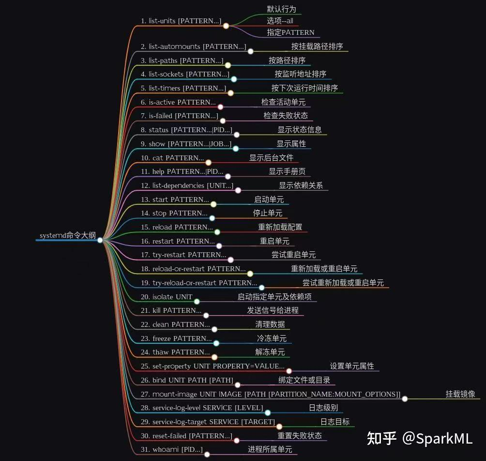
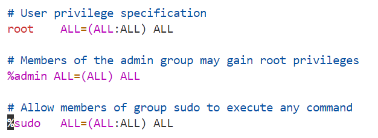

# 一.VM网络设置
sudo service network-manager stop
 sudo rm /var/lib/NetworkManager/NetworkManager.state
 sudo service network-manager start                                                                                           sudo gedit /etc/NetworkManager/NetworkManager.conf
# 二.ssh
# 三.文件结构
# 四.系统管理
## 4.1 systemctl命令
systemctl用于管理systemd系统和服务的命令行工具，systemd(/lib/systemd)是Linux系统中初始化系统和服务管理器。systemctl提供了与systemd交互的接口，用于启动(start),停止(stop),重启(restart)服务,查询服务状态(status)等操作
>*常用语法*
>
>- 启动服务：sudo systemctl start service_name
>- 停止服务：sudo systemctl stop service_name
>- 重启服务：sudo systemctl restart service_name
>- 查看服务状态：systemctl status service_name
>- 启动服务自启动:sudo systemctl enable service_name
>- 禁用服务自启动：sudo systemctl disable service_name
>- 查看所有正在运行的服务： systemctl list-units --type=service --state=running
>- 查看所有已启用的服务： systemctl list-unit-files --type=service --state=enabled
>- 查看服务日志： journalctl -u service_name
>- 重载 systemd 配置： systemctl daemon-reload
>- 查看系统默认 target： systemctl get-default
>- 设置系统默认 target： systemctl set-default target_name

## 4.2修改主机名与Host映射
修改主机名：sudo hostnamectl --static set-hostname name
host映射：将ip与name映射，在xshell中编不用填ip，可以直接填name远程连接
C:\Windows\System32\drivers\etc
# 五.软件包管理
APT(Advanced Packaging Tools)是
# 六.操作使用
## 6.1常用帮助
manual
快捷键

## 6.2文件目录的查看与切换
>- pwd(print working diretory):显示当前工作目录的**绝对路径**
>- /:代表根目录，即当前computer

>- cd:切换工作目录，cd .. 回到上一级目录 cd ../.. 可操控相对路径
cd    # 进入用户主目录；
cd /  # 进入根目录
cd ~  # 进入用户主目录；
cd ..  # 返回上级目录（若当前目录为“/“，则执行完后还在“/"；".."为上级目录的意思）；
cd ../..  # 返回上两级目录； .当前目录
cd !$  # 把上个命令的参数作为cd参数使用。
cd - 返回上一次所在目录
>- ls:显示当前工作目录下的文件，ls -l=ll            显示文件详细信息
## 6.3创建目录与文件
>- mkdir:创建目录
>- mkdir -p:创建多层目录
>- touch:创建文件 touch +文件名.格式
>- cp:拷贝文件 cd -r 文件夹 目的地址  cd  文件 目的地址
## 6.4 删除移动目录与文件
>- rm:
-d：直接把欲删除的目录的硬连接数据删除成0，删除该目录；
-f：强制删除文件或目录；
-i：删除已有文件或目录之前先询问用户；
-r或-R：递归处理，将指定目录下的所有文件与子目录一并处理；
--preserve-root：不对根目录进行递归操作；
-v：显示指令的详细执行过程。
rm -rf testdir
rm -r testdir

>- mv:--backup=<备份模式>：若需覆盖文件，则覆盖前先行备份；
-b：当文件存在时，覆盖前，为其创建一个备份；
-f：若目标文件或目录与现有的文件或目录重复，则直接覆盖现有的文件或目录；
-i：交互式操作，覆盖前先行询问用户，如果源文件与目标文件或目标目录中的文件同名，则询问用户是否覆盖目标文件。用户输入”y”，表示将覆盖目标文件；输入”n”，表示取消对源文件的移动。这样可以避免误将文件覆盖。
--strip-trailing-slashes：删除源文件中的斜杠“/”；
-S<后缀>：为备份文件指定后缀，而不使用默认的后缀；
--target-directory=<目录>：指定源文件要移动到目标目录；
-u：当源文件比目标文件新或者目标文件不存在时，才执行移动操作。
## 6.5 查看文件内容
>- cat:cat -n 显示所有的行号，小文件
>- more:
>- less:
>- tail:查看文件尾部 tail -显示行数 文件  tail -f 文件，实现不断监控的效果
## 6.6输出命令到控制台
>- echo: 在控制台打印字符 echo -e 内容 -e处理转义字符
>- echo -e 内容>文件：覆盖写入 >>为追加写入
## 6.7软链接(快捷方式)
ln -s ./tmp/xiyouji/qujing.txt ./猴哥

## 6.8查看历史命令
history
## 6.9vim使用
一般模式：复制删除 yy y p 
编辑模式：i 进入 esc退出
指令模式：： 进入 :wq保存并推出 ：！强制执行
## 6.10 时间命令管理
date "+%y"  %y 年 %m 月 %d 日
date "+%F %T"  %F 年月日 %T时分
echo `date -d '1 day ago' +"%F %T"`

# 七 用户管理命令
## 7.1添加新用户
>- adduser：sudo adduser name
## 7.2查看和切换用户
>- passwd user 设置用户密码 sudo 
>- id user 查看用户信息
>- su user 切换用户,不同用户之间的home不一样 ,PATH路径不同

## 7.3删除与修改用户
>- sudo userdel username 删除用户，保留主目录
>- sudo userdel -r username 删除干净，释放id与home文件
>- sudo usermod -l newusername username 修改用户名

## 7.4用户组的管理命令
Linux下的用户属于与它同名的用户组，创建用户时已经创建了同名的用户组
>- sudo groupadd groupname:创建组
>- sudo cat /ect/group ：查看组
>- sudo groupdel groupname：删除组
>- sudo groupmod -n newname oldname:修改组名

>- 添加移除用户
用户的组分为主组与附加组，主组在创建时被指定，默认与用户名称相同，
修改主组:sudo usermod -g heihei haha 将haha修改为heihei主组
修改附加组：
sudo usermod -aG moss haha  将haha修改为moss附加组里

移除用户
 sudo deluser haha moss 将haha 由moss中移除出去

 sudo组管理(设置普通用户有sudo权限)
 sudo借用root权限，将命令交给root执行，默认只有创建系统使用的用户可以执行sudo
 eg.
 haha@ubuntu:/$ sudo touch pofang.txt
[sudo] password for haha: 
haha is not in the **sudoers file**.  This incident will be reported.

如何修改sudo成员的权限？
sudo vim etc/sudoers

最后一行使得sudo组的成员拥有执行任何命令的权限，可在ALL前面添加NOPASSWD:,使得该组成员通过sudo命令操作时，不需要使用密码 使用：wq!

使其他用户获得sudo权限，将其添加进sudo附加组里面

执行sudo usermod -aG sudo haha

## 八.文件权限
## 8.1文件属性

-代表文件
d代表文件夹
l代表连接

r：读，w：写(并不代表能删，删除文件与目录的权限在上层目录) x执行 (文件)
第一个所有者(作者)权限，第二个组权限 所有者又属于组，累加权限 最后一个表示other权限

对于文件夹r可读代表使用读取，使用ls查看目录
w代表可以目录内部创建修改删除重命名目录文件

x代表可以进去该目录

## 8.2权限修改
只有root权限能够修改，即使是文件/目录所有者也无法修改
chmod u+x 文件/目录   u代表所有者，g代表组用户，o代表other a代表所有(可以不加)
u符号代表当前用户。
g符号代表和当前用户在同一个组的用户，以下简称组用户。
o符号代表其他用户。
a符号代表所有用户。
r符号代表读权限以及八进制数4。
w符号代表写权限以及八进制数2。
x符号代表执行权限以及八进制数1。
X符号代表如果目标文件是可执行文件或目录，可给其设置可执行权限。
s符号代表设置权限suid和sgid，使用权限组合u+s设定文件的用户的ID位，g+s设置组用户ID位。
t符号代表只有目录或文件的所有者才可以删除目录下的文件。
+符号代表添加目标用户相应的权限。
-符号代表删除目标用户相应的权限。
=符号代表添加目标用户相应的权限，删除未提到的权限。

r=4 w=2 x=1  使用3位2进制代表3个权限
chmod 764 hello.txt u有3个权限，g有前两个 o仅有一个  
chmod g=rwx hello.txt
chmod g-x,o-r hello.txt

## 8.3改变文件/目录 所有者与所属组
>- 修改所有者 chown  新所有者 文件/目录

>-修改所属组 chgrp 新所属组 文件/目录

>- 同时修改:chown 所有者：所属组 文件/目录

# 九.搜索查找
## 9.1 find命令
>-  find[搜索范围][选项]
选项：-name -user -size -type
精准搜索
find ./ -name redis.txt
返回文件绝对路径

模糊搜索
find ./ -name "*.txt" 
*代表任意字符
find ./ ! -name "*.txt"
找出所有不是以.txt结尾的文件

根据用户搜索
find ./ -user username 
搜索所有者为uername的文件

根据文件类型进行搜索
find . -type 类型参数
类型参数列表：

f 普通文件
l 符号连接
d 目录
c 字符设备
b 块设备
s 套接字
p Fifo

根据文件大小进行匹配
find . -type f -size 文件大小单元
文件大小单元：
b —— 块（512字节）
c —— 字节
w —— 字（2字节）
k —— 千字节
M —— 兆字节
G —— 吉字节

基于目录深度搜索
向下最大深度限制为3
find . -maxdepth 3 -type f
搜索出深度距离当前目录至少2个子目录的所有文件
find . -mindepth 2 -type f

find . -maxdepth 4 -name "*.txt"

## grep过滤查找与"|"管道符
moss@ubuntu:~$ ll | grep test
drwxr-xr-x 11 root root    4096 4月  15 18:14 oftest/
drwxrwxr-x  2 moss moss    4096 8月  19 16:57 test/

将ll输出信息通过|给grep进行匹配字符查找
可模糊查找，匹配字符
可加-v反向查找,-n输出行数
ll | grep -v rw
可输出命令均可，如cat,ls,find
cat log.txt | grep -n if

# 十.压缩解压
## 10.1 gzip/gunzip压缩
gzip 文件：压缩文件，格式为*.gzp
gunzip 文件

## 10.2 tar打包 
tar [选项] XXX.tar.gz 
打包目录目录，压缩文件格式为.tar.gz
常用选项
-c:产生.tar打包文件
-v：显示详细信息
-f：指定打包后文件名
-z:打包同时压缩
-x:解包.tar文件

打包压缩：-zcvf
解压解包：-zxvf
tar -zxvf *.tar.gz -C location //解压location

# 十一.硬件资源监控管理
## 11.1磁盘类
查看磁盘空间使用情况
>- 整个磁盘使用情况
df -h:-h 修改单位，不再用k而是用合适的单位
Mounted on：挂载点 类似于c盘，d盘，将文件挂挂载点，硬盘上
Filesystem     1K-blocks     Used Available Use% Mounted on
/dev/sda5       40454400 12927308  25439924  34% /
/dev/sda5        39G   13G   25G  34% /

>- 当前路径下的目录文件磁盘使用情况
du name
moss@ubuntu:~$ du tmp
4       tmp/xiyouji/sunwukong
8       tmp/xiyouji
4       tmp/qujing
20      tmp

moss@ubuntu:~$ du tmp -h
4.0K    tmp/xiyouji/sunwukong
8.0K    tmp/xiyouji
4.0K    tmp/qujing
20K     tmp 

du -sh 只显示文件夹或文件占了多少空间

## 11.2 进程监控查看
ps：process status 查看进程状态
>- ps -aux | grep ×× ：ps -aux查看所有进程 ××为进程号 重点关注对cpu和磁盘的占用
moss@ubuntu:~$ ps -aux | grep 2559
USER         PID  %CPU %MEM  VSZ    RSS   TT  STAT STARTED    TIME COMMAND
moss        2559  0.2  0.1  14136  5856 ?        S    15:38   0:02 sshd: moss@notty
moss        3295  0.0  0.0  12116  2828 pts/1    S+   15:56   0:00 grep --color=auto 2559
第二个为ps进程本身
USER：该 process 属于那个使用者账号的 
PID ：该 process 的号码
%CPU：该 process 使用掉的 CPU 资源百分比
%MEM：该 process 所占用的物理内存百分比
VSZ ：该 process 使用掉的虚拟内存量 (Kbytes)
RSS ：该 process 占用的固定的内存量 (Kbytes)
TTY ：运行终端位置，该 process 是在那个终端机上面运作，若与终端机无关，则显示 ?，另外， tty1-tty6 是本机上面的登入者程序，若为 pts/0 等等的，则表示为由网络连接进主机的程序。
STAT：该程序目前的状态，主要的状态有
R ：该程序目前正在运作，或者是可被运作
S ：该程序目前正在睡眠当中 (可说是 idle 状态)，但可被某些讯号 (signal) 唤醒。
T ：该程序目前正在侦测或者是停止了
Z ：该程序应该已经终止，但是其父程序却无法正常的终止他，造成 zombie (疆尸) 程序的状态
START：该 process 被触发启动的时间
TIME ：该 process 实际使用 CPU 运作的时间
COMMAND：该程序的实际指令

>- ps -ef | grep ×× ：重点关注进程之间的关系
moss@ubuntu:~$ ps -ef | grep 2559
UID         PID(进程id)  PPID（父进程id） C  START    TTY      TIME     COMMAND
moss        2559    2482        0           15:38    ?        00:00:03 sshd: moss@notty
moss        2561    2559        0           15:38    ?        00:00:00 bash
moss        3467    2727        0           16:04    pts/1    00:00:00 grep --color=auto 2559
C：CPU用于计算执行优先级的因子，数值越大，表明进程为CPU密集型运算，执行优先级低；数值小，表面进程为I/O密集型运输，执行优先级高

## 11.3 kill终止进程
kill [选项] PID:杀死相应进程号进程
选项：-9 表示强迫进程立即停止

## 11.4 内存与监控页面
查看服务器总体内存使用情况
free -m 选项为单位

监控页面：top 
top - 16:52:48 up  1:23,  1 user,  load average: 0.00, 0.01, 0.00
Tasks: 324 total,   1 running, 323 sleeping,   0 stopped,   0 zombie
%Cpu(s):  0.2 us,  0.6 sy,  0.0 ni, 99.3 id,  0.0 wa,  0.0 hi,  0.0 si,  0.0 st
MiB Mem :   3876.1 total,   1847.9 free,   1212.8 used,    815.4 buff/cache
MiB Swap:   1873.4 total,   1873.4 free,      0.0 used.   2409.0 avail Mem 
  
  PID USER      PR  NI    VIRT    RES    SHR S  %CPU  %MEM     TIME+ COMMAND

## 11.5 网络端口号占用监控
>- netstat -anp |grep 进程号：查看进程网络信息 
Active Internet connections (w/o servers)
Proto Recv-Q Send-Q Local Address           Foreign Address         State      
tcp        0    127 localhost:39187         localhost:51328         ESTABLISHED
tcp        0      0 localhost:51328         localhost:39187         ESTABLISHED
tcp        0    164 ubuntu:ssh              192.168.88.1:52136      ESTABLISHED
192.168.88.1为windowsIP 意味着windows在和ubuntu连接

moss@ubuntu:~$ sudo netstat -anp |grep 2482
tcp        0    100 192.168.88.101:22       192.168.88.1:52136      ESTABLISHED 2482/sshd: moss [pr 
unix  2      [ ]         DGRAM      CONNECTED     66764    2482/sshd: moss [pr  
unix  3      [ ]         STREAM     CONNECTED     67845    2482/sshd: moss [pr  
unix  2      [ ]         STREAM     CONNECTED     65786    2482/sshd: moss [pr 

moss@ubuntu:~$ sudo netstat -anp -p  |grep 52136(端口号) 加-p查看网络端口号占用情况，显示进程信息
tcp        0      0 192.168.88.101:22       192.168.88.1:52136      ESTABLISHED 2482/sshd: moss [pr 
2482为pid

加-nlp查看具体信息
moss@ubuntu:~$ sudo netstat -nlp | grep ssh
tcp        0      0 0.0.0.0:22              0.0.0.0:*               LISTEN      1102/sshd: /usr/sbi 
tcp6       0      0 :::22                   :::*                    LISTEN      1102/sshd: /usr/sbi 
unix  2      [ ACC ]     STREAM     LISTENING     53290    1555/systemd         /run/user/1000/gnupg/S.gpg-agent.ssh
unix  2      [ ACC ]     STREAM     LISTENING     52826    1564/gnome-keyring-  /run/user/1000/keyring/ssh
unix  2      [ ACC ]     STREAM     LISTENING     53635    1652/ssh-agent       /tmp/ssh-9xLc5Q5g3JDZ/agent.1585

如果释放端口号，kill对应进程即可

加-a 最详细

## 11.6 crontab定时任务
查询服务
sudo systemctl status cron
重启服务
sudo systemctl restart cron

定时任务设置
crontab [选项]
-e：编辑该用户的计时器设置；
-l：列出该用户的计时器设置；
-r：删除该用户的计时器设置；
-u<用户名称>：指定要设定计时器的用户名称。

环境变量设置，为crontab添加vim编辑器
EDITOR=vim crontab -e

编辑： 
用户所建立的crontab文件中，每一行都代表一项任务，每行的每个字段代表一项设置，它的格式共分为六个字段，前五段是时间设定段，第六段是要执行的命令段，格式如下：
minute   hour   day   month   week   command     顺序：分 时 日 月 周 如果使用* 则代表任何时间，,代表不连续的时间 0 8,12,16*** 代表每天的8点0分，12点0分，16点0分 -表示连续的时间 0 5 **1-6 周一到周六5点0分都执行 */n 表示每隔多久执行一次 
*/1 * * * * /bin/echo "1">>/home/moss/bai.txt

# Shell基础
shell是一个命令解释器，接收应用程序或者用户命令，调用操作系统内核
moss@ubuntu:~$ cat /etc/shells (所有解释器)
# /etc/shells: valid login shells
/bin/sh
/bin/bash
/usr/bin/bash
/bin/rbash
/usr/bin/rbash
/bin/dash
/usr/bin/dash

moss@ubuntu:~$ echo $SHELL (当前使用的解释器)
/bin/bash

## shell脚本入门
脚本执行：
>- bash *.sh (相对路径，绝对路径均可)
>- sh *.sh
moss@ubuntu:~/bin$ sh hello.sh
hello world
>- 直接调脚本(相对路径或者绝对路径)
moss@ubuntu:~/bin$ ./hello.sh
hello world

不能直接写hello.sh

第一种用bash权限